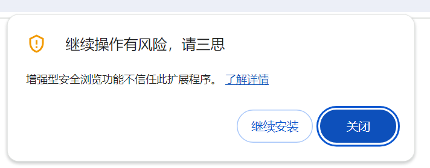

# What is vTab

**vTab is vertical tab manager for your browser.**

You can manage browser tabs in the sidebar as fast as lightning.

It will not have any impact on your current browsing experience.

**feature list**: 
- ⚙️ manage tabs(check, switch, close, new, search) in sidebar smoothly
- ❄️ freeze tabs & freeze all tabs in the window (free RAM of you PC);
- 🥳 **SORT by freezed status**(show unfreezed tabs together at top for easily access);
- 🎉 **SORT by URL/host**(show same host websit together);
- 📌 pin the vTab sidebar on left/right of your page;
- ❄️ **freeze tabs that inactive for 36 hours automatically**;
- ❌ archive tabs that inactive for 7 days automatically;

**Telegram Group**: [vtab users](https://t.me/+QQLV4RqH4940NjNl)

vTab 给你的浏览器提供一个快如闪电的**侧边栏标签页管理器**。

并且，它不会影响你现在的浏览器使用体验。

**功能列表**：
- ⚙️ 在任意网页中通过vTab侧边栏管理标签页（查看、切换、关闭、新建、搜索）
- ❄️ **冻结**单个标签页和冻结窗口中的所有标签页（可释放内存）；
- 🥳 **按冻结状态排序**（将未冻结的标签页排在顶部，以便轻松访问）；
- 🎉 **按照网站排序**（相同域名会排在一起）；
- 📌 将vTab侧边栏固定在页面左侧（或右侧）；
- ❄️ **自动冻结**36小时未活跃的选项卡；
- ❌ 自动归档7天未活跃的选项卡；

# How to Install 

1. **[Install from Chrome Web Store](https://chromewebstore.google.com/detail/vtab/fkmcgnjikengcgbeadhmdeneagpdgaea)**

2. **[Install from releases](https://github.com/wolf3c/vTab/releases)**

# Why develop this new vertical tab manager?

There are three reasons why I develop this Chrome extension: 

1. firstly, I opened to many tabs and windows in Chrome. It's hard to switch into the new tabs because there is no space show the tab at top. And it's hard to check the tabs I opened several months.
2. then, there are so many tabs manager extensions I found, but they used Chrome side panel technique. The operation of toggling the side panel is not smooth. And the minimal width of side panel takes a lot of space.
3. finally, AI empowered my technique. I asked GPT build the first version of vTab in 1hour 52mins.

# Q&A

### 1. 为什么弹出「增强型安全浏览功能不信任此扩展程序」提醒？应该如何处理？

因为我是一个新的 Chrome extension 开发人员，[还没有被列入 **Chrome Web Store 开发人员计划政策**](https://pcservices.com.my/2021/06/06/google-chrome-%E7%8E%B0%E5%9C%A8%E8%AD%A6%E5%91%8A%E7%94%A8%E6%88%B7%E6%9D%A5%E8%87%AA%E4%B8%8D%E5%8F%97%E4%BF%A1%E4%BB%BB%E5%BC%80%E5%8F%91%E8%80%85%E7%9A%84%E6%89%A9%E5%B1%95%E7%A8%8B%E5%BA%8F/)，我所开发的所有插件都会出现此弹窗以提醒用户谨慎使用，但这并不代表 vTab 有问题，vTab 所有代码开源，欢迎监督，并且也有很多前端开发人员在使用 vTab，**没有任何秘密代码，请放心使用**。

在安装 vTab 过程中碰到此提醒，**请放心点击「继续安装」 Continue to install**。

# ❤️ Support Me
